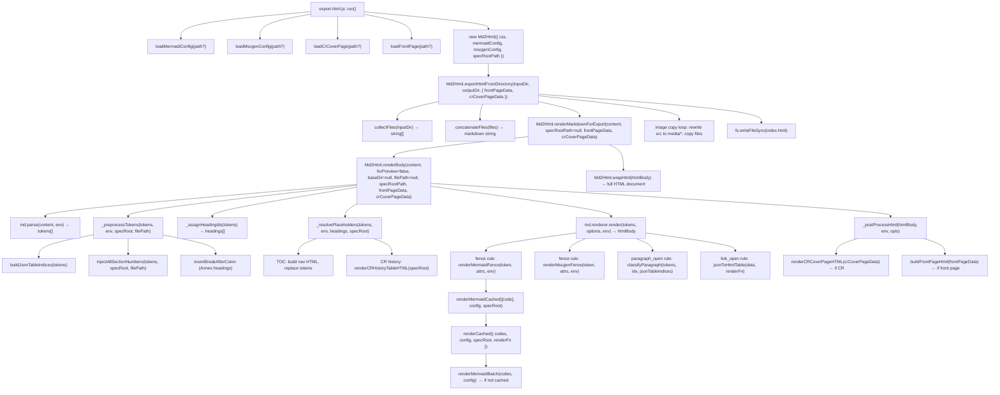
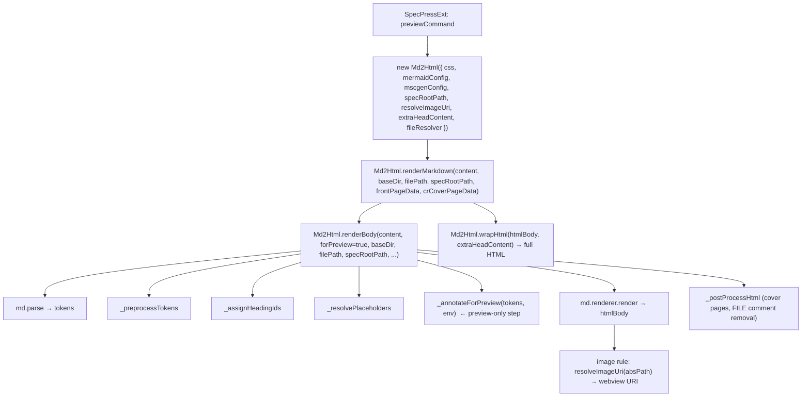
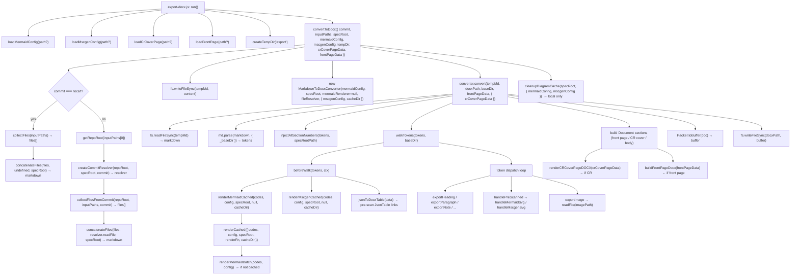
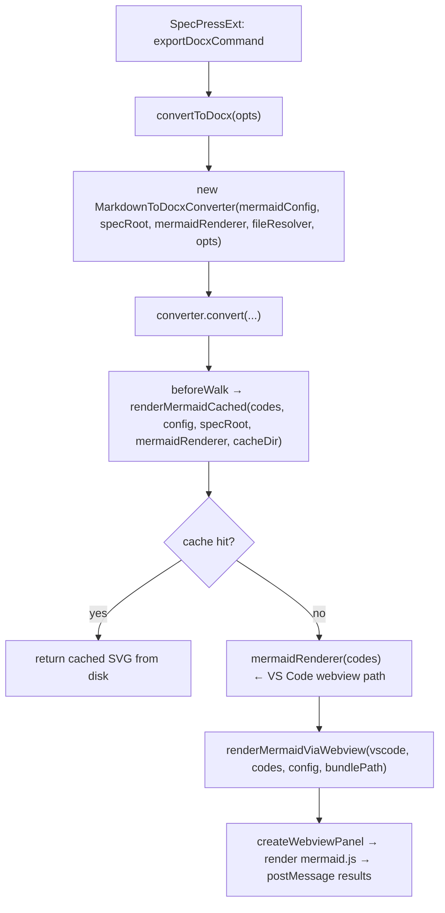
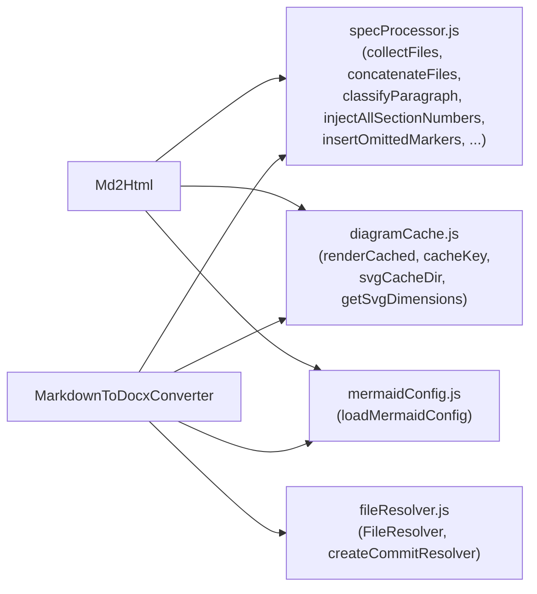

# SpecPress Pipeline Analysis: HTML and DOCX Generation

This document maps the full call flows for both the HTML and DOCX export pipelines,
identifies structural inconsistencies, and evaluates whether the current design is
reasonable or could be simplified.

---

## 1. Entry Points

Both pipelines share the same two entry points:

| Entry point | Pipeline |
|---|---|
| `cli/export-html.js` | HTML (CLI) |
| `cli/export-docx.js` | DOCX (CLI) |
| `Md2Html.renderMarkdown()` | HTML (VS Code preview) |
| `Md2Html.exportHtmlFromDirectory()` | HTML (VS Code export) |
| `convertToDocx()` | DOCX (VS Code export, via `docx-export-utils.js`) |

---

## 2. HTML Pipeline

### 2.1 Call Flow — CLI Export



### 2.2 Call Flow — VS Code Preview



### 2.3 Key `env` object passed through rendering

The `env` object is the primary side-channel for passing context into markdown-it renderer rules:

| Field | Set by | Used by |
|---|---|---|
| `_baseDir` | `renderBody`, updated by `html_block` FILE rule | `link_open` (JsonTable), `image` rule |
| `_mermaidConfig` | `renderBody` (from `this.mermaidConfig`) | `mermaidFenceHtml.renderMermaidFence` |
| `_mscgenConfig` | `renderBody` (from `this.mscgenConfig`) | `mscgenFenceHtml.renderMscgenFence` |
| `_specRootPath` | `renderBody` | `mermaidFenceHtml` (cache path), `_resolvePlaceholders` |
| `_resolveUris` | `renderBody` | `image` rule |
| `_forPreview` | `_annotateForPreview` | `fence` rule (ASN.1 line annotations) |
| `_jsonTableIndices` | `_preprocessTokens` | `paragraph_open` rule, `_resolvePlaceholders` |
| `_skipLinkTokens` | `link_open` rule | `text` rule, `link_close` rule |

---

## 3. DOCX Pipeline

### 3.1 Call Flow — CLI Export



### 3.2 VS Code DOCX Export

The VS Code extension calls `convertToDocx()` directly (same function as CLI), but
injects a `mermaidRenderer` via `MarkdownToDocxConverter` constructor. The renderer
is `makeMermaidRenderer(vscode, context)` from `SpecPressExt/src/vscode/helpers.js`,
which calls `renderMermaidViaWebview()` instead of `renderMermaidBatch()`.



---

## 4. Shared Infrastructure

Both pipelines share these modules from `lib/common/`:



---

## 5. Consistency Analysis

### 5.1 What is consistent ✓

- **Paragraph classification**: both pipelines call `classifyParagraph()` from `specProcessor.js` — single source of truth.
- **Section number injection**: both call `injectAllSectionNumbers()` before rendering.
- **Annex heading line break**: both call `insertBreakAfterColon()` for `h1` Annex headings.
- **Diagram caching**: both use `renderCached()` / `renderCachedAsync()` from `diagramCache.js`.
- **Cache key**: both use `cacheKey(code, config)` — SHA-256 of `code + '\0' + config`.
- **File collection**: both use `collectFiles()` / `concatenateFiles()` from `specProcessor.js`.
- **Cover page precedence**: CR cover page takes precedence over front page in both pipelines.

### 5.2 Inconsistencies and structural issues ✗

#### (a) `concatenateFiles` called without `specRoot` in HTML export

In `Md2Html.exportHtmlFromDirectory()`:
```js
const content = concatenateFiles(files)   // no specRoot → no folder headings
```
In `convertToDocx()` (DOCX):
```js
content = concatenateFiles(files, undefined, opts.specRoot)  // specRoot passed
```
The HTML export silently omits auto-generated folder headings. This is probably
unintentional — the `specRootPath` is available on `this.specRootPath` but not
forwarded to `concatenateFiles`.

#### (b) `renderMarkdownForExport` passes `specRootPath=null` instead of `this.specRootPath`

```js
// exportHtmlFromDirectory:
let html = this.renderMarkdownForExport(content, null, frontPageData, crCoverPageData)
//                                              ^^^^
// renderMarkdownForExport then calls renderBody with specRootPath=null
// renderBody: effectiveSpecRoot = specRootPath !== null ? specRootPath : this.specRootPath
```
This actually works correctly because `renderBody` falls back to `this.specRootPath`
when `null` is passed. But it is confusing — the caller explicitly passes `null`
when it could just omit the argument or pass `this.specRootPath` directly.

#### (c) `MarkdownToDocxConverter` constructor has positional parameters instead of an options object

```js
new MarkdownToDocxConverter(mermaidConfig, specRootPath, mermaidRenderer, fileResolver, options)
```
Four positional parameters before the options bag. Compare with `Md2Html` which uses
a clean single options object. The DOCX constructor is harder to call correctly
(easy to accidentally swap `mermaidRenderer` and `fileResolver`) and harder to extend.

#### (d) `convert()` re-reads the markdown file from disk

`convertToDocx()` writes the concatenated markdown to a temp file, then `convert()`
reads it back:
```js
fs.writeFileSync(tempMd, content)          // write
// ...
const markdown = readFileSync(markdownPath, 'utf-8')  // read back
```
This write-then-read round-trip through the filesystem is unnecessary. The content
string is already in memory. The `convert()` method could accept the markdown string
directly (or as an alternative overload), avoiding the temp file entirely for the
content (though the temp file is still needed for the output DOCX path).

#### (e) `injectAllSectionNumbers` called twice in the DOCX path

In `convertToDocx()` → `convert()`:
```js
// convert():
injectAllSectionNumbers(tokens, this.specRootPath)   // ← called here
await this.walkTokens(tokens, baseDir)
```
But `concatenateFiles()` already embeds `<!-- FILE: ... -->` markers, and
`injectAllSectionNumbers` handles multi-file mode via those markers. This is
correct and only called once — but the call is inside `convert()` which is
also called directly from tests, so the placement is intentional. No actual
double-call issue, but worth noting that the HTML pipeline does this in
`_preprocessTokens` (a named step), while DOCX does it inline in `convert()`.

#### (f) `mermaidFenceHtml.js` imports from `md2docx/handlers/mermaidHandler.js`

```js
// mermaidFenceHtml.js (HTML handler):
const { renderMermaidCached, getSvgDimensions } = require('../../md2docx/handlers/mermaidHandler')
```
The HTML handler reaches into the DOCX handler module. This creates a
cross-layer dependency: `md2html/` → `md2docx/`. The shared functions
(`renderMermaidCached`, `getSvgDimensions`) belong in `common/` or
`common/diagramCache.js` (where `getSvgDimensions` already lives).
`renderMermaidCached` is a thin wrapper around `renderCached` from `diagramCache.js`
and could live there too.

#### (g) `ctx` object in DOCX `walkTokens` is an ad-hoc bag

The walk context object is assembled inline:
```js
const ctx = { skipIndices, fileDirByIndex, jsonTableIndices, baseDir }
// then augmented in beforeWalk:
ctx.svgByIndex = ...
ctx.mscgenSvgByIndex = ...
ctx.jsonTableByIndex = ...
```
This is a reasonable pattern but the shape is implicit. A documented type or
class would make it clearer what `ctx` contains and what each `export*` method
can expect.

#### (h) `mermaidConfig` type inconsistency

- `Md2Html` constructor: `options.mermaidConfig` is a JSON string (or loaded via `loadMermaidConfig`).
- `MarkdownToDocxConverter` constructor: `mermaidConfig` is also a JSON string, but documented as `string|null`.
- `renderMermaidBatch(codes, mermaidConfig)`: receives the JSON string.
- `renderMermaidCached(codes, config, specRoot, renderFn, cacheDir)`: parameter named `config` (not `mermaidConfig`).
- `renderCached(opts)`: `opts.config` is the JSON string.

The name oscillates between `mermaidConfig` and `config` across the call chain.
Not a bug, but adds cognitive load.

---

## 6. Parameter Bundling Opportunities

The pipelines pass many related parameters individually. Several natural groupings emerge:

### 6.1 `RenderContext` — shared rendering configuration

Currently scattered across constructor options and `env`:

```js
// Candidate bundle:
{
  mermaidConfig,   // JSON string
  mscgenConfig,    // JSON string
  specRootPath,    // absolute path
  cacheDir,        // absolute path or null
}
```
Used by: `Md2Html` constructor, `MarkdownToDocxConverter` constructor,
`renderMermaidCached`, `renderMscgenCached`, `convertToDocx`.

### 6.2 `CoverPageOptions` — front page / CR cover page

```js
// Candidate bundle:
{
  frontPageData,      // object | null
  crCoverPageData,    // object | null
}
```
Currently passed as two separate parameters through:
`exportHtmlFromDirectory` → `renderMarkdownForExport` → `renderBody` → `_postProcessHtml`
and
`convertToDocx` → `converter.convert` → `convert()`

The two are mutually exclusive (CR takes precedence), so bundling them makes
the precedence rule easier to enforce in one place.

### 6.3 `WalkContext` (DOCX only) — already partially bundled

The `ctx` object in `walkTokens` is a good start. Making its shape explicit
(e.g. with a JSDoc typedef) would improve readability without requiring a class.

---

## 7. Summary of Findings

| # | Issue | Severity | Location |
|---|---|---|---|
| a | `concatenateFiles` called without `specRoot` in HTML export | Bug / inconsistency | `md2html.js:exportHtmlFromDirectory` |
| b | `renderMarkdownForExport` passes `null` for `specRootPath` unnecessarily | Confusing | `md2html.js:exportHtmlFromDirectory` |
| c | `MarkdownToDocxConverter` uses positional params instead of options object | Design | `md2docx.js` constructor |
| d | Write-then-read round-trip for markdown content via temp file | Inefficiency | `convertToDocx.js` + `md2docx.js:convert` |
| e | `injectAllSectionNumbers` placement differs between HTML and DOCX | Inconsistency | `md2html.js:_preprocessTokens` vs `md2docx.js:convert` |
| f | `mermaidFenceHtml.js` imports from `md2docx/` (cross-layer dependency) | Architecture | `md2html/handlers/mermaidFenceHtml.js` |
| g | `ctx` shape in `walkTokens` is implicit / undocumented | Readability | `md2docx.js:walkTokens` / `beforeWalk` |
| h | `mermaidConfig` vs `config` naming inconsistency across call chain | Readability | multiple files |

The most impactful fixes would be **(a)** (actual behavioral difference between
HTML and DOCX), **(d)** (unnecessary I/O), and **(f)** (architectural boundary
violation). The others are readability/maintainability improvements.
