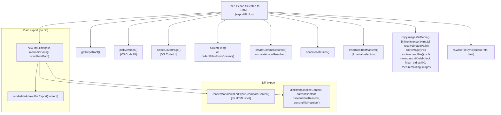
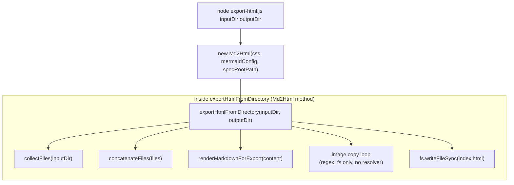
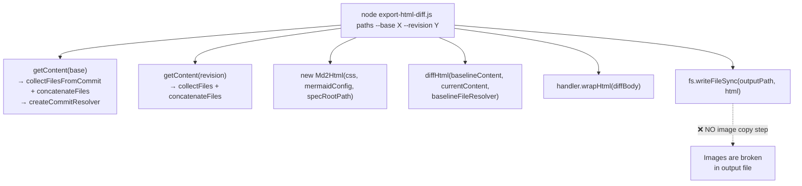
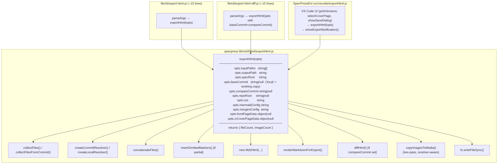

# HTML Export Architecture

## Current call graph — SpecPressExt "Export Selected to HTML"

The VS Code command handles both plain export and diff export in a single
function. The diagram below shows every specpress function it calls.

The image copy logic is **inline** inside `exportHtml.js` — it is not a
shared library function.

---

## Current call graph — CLI `export-html.js` (plain export)

---

## Current call graph — CLI `export-html-diff.js`

---

## Problems with the current CLI paths

| | `export-html.js` | `export-html-diff.js` |
|---|---|---|
| Image copy | ✅ yes, but old regex loop | ❌ missing entirely |
| Git-sourced images | ❌ no resolver, fs only | ❌ no resolver |
| Diff support | ❌ no | ✅ yes |
| Omitted-section markers | ❌ no | ❌ no |
| Code duplication vs SpecPressExt | ✅ high | ✅ high |

---

## Proposed solution — extract `exportHtml()` to specpress

The entire body of `exportHtml.js` (minus the VS Code UI calls) is pure
file-system logic that belongs in specpress. Extract it as a library
function `exportHtml(opts)` in `lib/md2html/exportHtml.js`, then:

- Both CLI scripts become thin wrappers that parse args and call it.
- SpecPressExt's `exportHtml.js` also calls it (replacing its inline logic).
- `exportHtmlFromDirectory` on `Md2Html` can be removed or kept as a
  thin wrapper for backwards compatibility.

### What `exportHtml()` replaces

| Today | After |
|---|---|
| `exportHtmlFromDirectory` (Md2Html method, local-only) | deleted / thin wrapper |
| image copy loop in `exportHtml.js` (SpecPressExt) | moved to `exportHtml()` |
| missing image copy in `export-html-diff.js` | fixed for free |
| `export-html.js` CLI (~60 lines) | ~15 lines |
| `export-html-diff.js` CLI (~90 lines) | ~15 lines |

The two CLI scripts become identical in structure to `export-docx.js` and
`export-docx-diff.js` — they just parse args and delegate everything to the
library.
