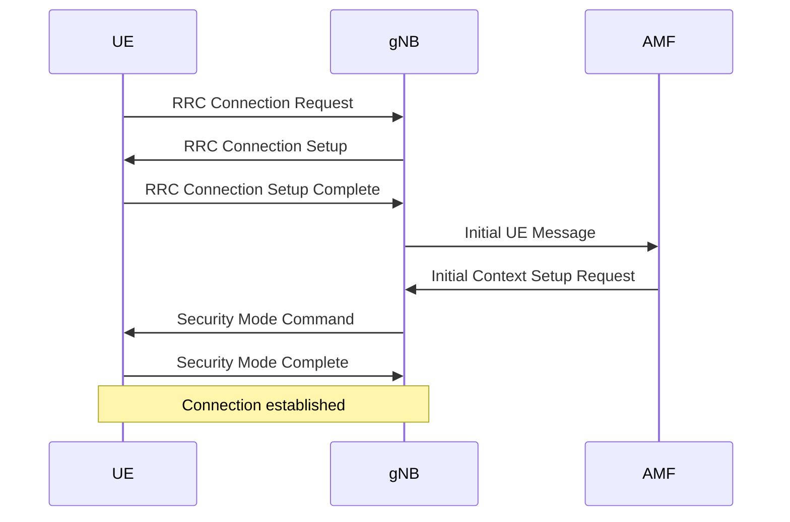

# Technical Specification - Version 2

## 1 Scope

This document defines the technical requirements for the communication protocol between network elements in 5G networks.

## 2 References

The following documents contain provisions which, through reference in this text, constitute provisions of the present document.

- [1] 3GPP TS 38.300: "NR; Overall description; Stage 2"
- [2] 3GPP TS 38.413: "NG-RAN; NG Application Protocol (NGAP)"
- [3] 3GPP TS 38.331: "NR; Radio Resource Control (RRC) protocol specification"

## 3 Definitions and Abbreviations

### 3.1 Definitions

For the purposes of the present document, the following terms and definitions apply:

**Base Station**: A network element that provides radio coverage.

**User Equipment**: A mobile device that connects to the network.

**Cell**: The geographical area covered by a base station.

### 3.2 Abbreviations

For the purposes of the present document, the following abbreviations apply:

- AMF Access and Mobility Management Function
- gNB Next Generation Node B
- UE User Equipment
- QoS Quality of Service
- RRC Radio Resource Control

## 4 General Architecture

### 4.1 Overview

The system architecture consists of three main components:

- Core Network (CN)
- Radio Access Network (RAN)
- User Equipment (UE)

The communication between these components is based on standardized interfaces defined by 3GPP.

### 4.2 Protocol Stack

The protocol stack includes the following layers:

- Physical Layer (PHY)
- Medium Access Control (MAC)
- Radio Link Control (RLC)
- Packet Data Convergence Protocol (PDCP)
- Service Data Adaptation Protocol (SDAP)

**NOTE 2**: SDAP is only used in 5G networks.

## 5 Mathematical Models

### 5.1 Signal-to-Noise Ratio

The signal-to-noise ratio is calculated as:

$$ SNR = 10 \log_{10} \left( \frac{P_{signal}}{P_{noise}} \right) $$

where $P_{signal}$ is the signal power and $P_{noise}$ is the noise power.

### 5.2 Channel Capacity

The Shannon channel capacity is given by:

$$ C = B \log_2 (1 + SNR) $$

where $C$ is the capacity in bits per second and $B$ is the bandwidth in Hertz.

### 5.3 Path Loss

The path loss in dB is calculated using the following formula:

$$ PL = 128.1 + 37.6 \log_{10}(d) $$

where $d$ is the distance in kilometers.

## 6 Interface Parameters

### 6.1 Timing Parameters

Table 6.1-1: Timing parameters

| Parameter | Value | Unit | Description                                         |
| --------- | ----- | ---- | --------------------------------------------------- |
| T300      | 1000  | ms   | RRC connection setup timeout                        |
| T301      | 2000  | ms   | RRC connection re-establishment timeout             |
| T310      | 3000  | ms   | Radio link failure timer                            |
| T311      | 10000 | ms   | RRC connection re-establishment procedure timer     |
| T319      | 5000  | ms   | RRC suspend timer                                   |

### 6.2 Power Parameters

The transmit power shall be within the following ranges:

- Minimum power: -40 dBm
- Maximum power: 23 dBm
- Power control step: 1 dB
- Power control range: 63 dB

## 7 Procedures

### 7.1 Connection Establishment

The connection establishment procedure consists of the following steps:

- UE sends RRC Connection Request with establishment cause
- gNB responds with RRC Connection Setup
- UE sends RRC Connection Setup Complete
- Connection is established

**NOTE 1**: The UE shall include its capabilities in the RRC Connection Setup Complete message.

### 7.2 Handover Procedure

The handover procedure is initiated when the signal quality falls below a threshold.

**EXAMPLE**: If the RSRP is below -110 dBm for more than 5 seconds, the UE triggers a measurement report.

The handover can be either intra-frequency or inter-frequency depending on the target cell.

### 7.3 Connection Release

The connection release procedure is initiated by the network when the UE is idle for an extended period.

- gNB sends RRC Connection Release
- UE acknowledges and returns to idle mode
- Context is cleared on both sides

## 8 Security

### 8.1 Authentication

The authentication procedure uses a challenge-response mechanism based on shared keys and 5G-AKA.

### 8.2 Encryption

All user plane data shall be encrypted using the specified algorithms:

- NEA0 (null encryption - for testing only)
- NEA1 (SNOW 3G)
- NEA2 (AES)
- NEA3 (ZUC)

**Editor's Note**: Algorithm selection is subject to operator policy and UE capabilities.

### 8.3 Integrity Protection

Control plane messages are protected using integrity algorithms:

- NIA1 (SNOW 3G)
- NIA2 (AES)
- NIA3 (ZUC)

## 9 Protocol Messages

### 9.1 Message Structure

The message structure follows ASN.1 encoding:

```asn
-- RRC Connection Request Message
RRCConnectionRequest ::= SEQUENCE {
    rrc-TransactionIdentifier   RRC-TransactionIdentifier,
    criticalExtensions          CHOICE {
        rrcConnectionRequest-r8     RRCConnectionRequest-r8-IEs,
        criticalExtensionsFuture    SEQUENCE {}
    }
}

RRCConnectionRequest-r8-IEs ::= SEQUENCE {
    ue-Identity                 InitialUE-Identity,
    establishmentCause          EstablishmentCause,
    spare                       BIT STRING (SIZE (1))
}

-- New in v2: Connection Setup Message
RRCConnectionSetup ::= SEQUENCE {
    rrc-TransactionIdentifier   RRC-TransactionIdentifier,
    criticalExtensions          CHOICE {
        c1                          CHOICE {
            rrcConnectionSetup-r8       RRCConnectionSetup-r8-IEs
        },
        criticalExtensionsFuture    SEQUENCE {}
    }
}
```

### 9.2 Procedure Flow

The following diagram shows the connection establishment flow:



Figure 9.2-1: Connection establishment procedure

**NOTE 3**: The security mode command includes both *encryption* and **integrity** algorithm selection.

### 9.3 Configuration Parameters

The configuration includes *multi-level* parameters:

- 1> **Radio Parameters**:

  - 2> Frequency: Operating frequency band

  - 2> Bandwidth: Channel bandwidth configuration

    - 3> Minimum: 5 MHz

    - 3> Maximum: 100 MHz

  - 2> Power: Transmit power settings with **dynamic adjustment**

- 1> **Timer Values**:

  - 2> Short timers: Used for immediate responses

  - 2> Long timers: Used for periodic updates

  - 2> Emergency timers: For critical situations

- 1> **QoS Settings**:

  - 2> Priority levels from 1 to 15

  - 2> Delay budgets configured per flow

  - 2> Packet error rate thresholds

### 9.4 Capability Information

The following table uses *embedded* JsonTable format:

```jsonTable
{
  "columns": [
    {"key": "feature", "name": "Feature", "align": "left"},
    {"key": "supported", "name": "Supported", "align": "center"},
    {"key": "version", "name": "Version", "align": "center"}
  ],
  "rows": [
    {"feature": "Dual Connectivity", "supported": "Yes", "version": "Rel-15"},
    {"feature": "Carrier Aggregation", "supported": "Yes", "version": "Rel-15"},
    {"feature": "Beamforming", "supported": "No", "version": "-"},
    {"feature": "5G NR", "supported": "Yes", "version": "Rel-15"}
  ]
}
```

Table 9.4-1: UE capability support matrix

**NOTE 2**: The UE shall report all supported features during capability exchange.
